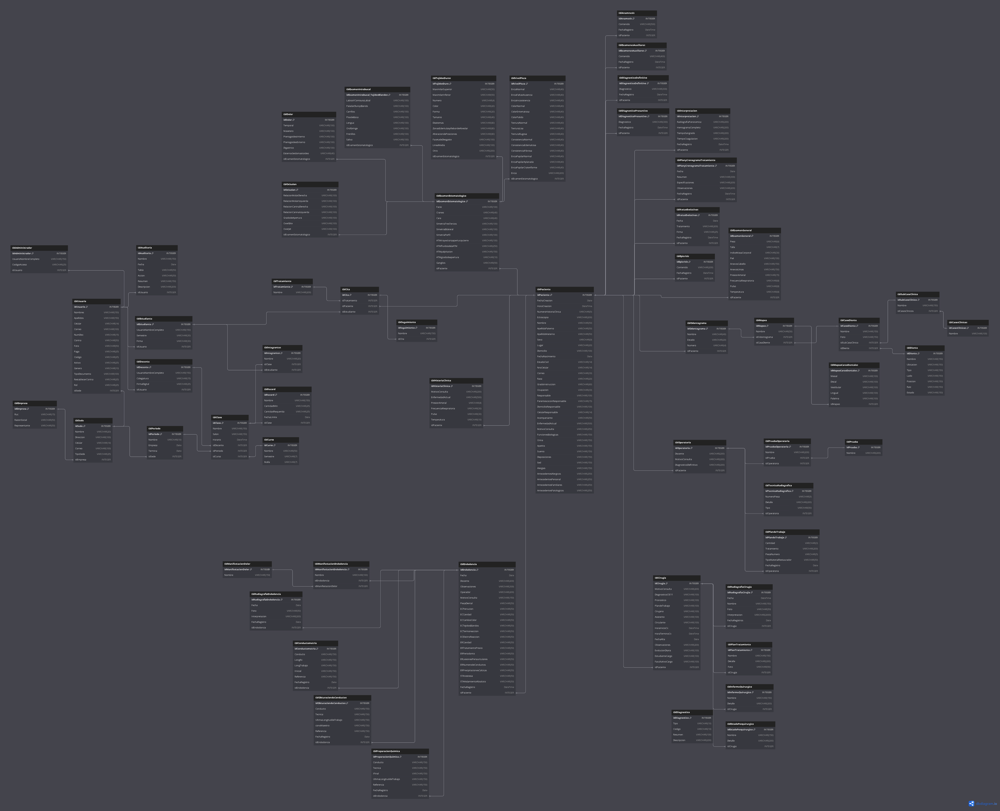
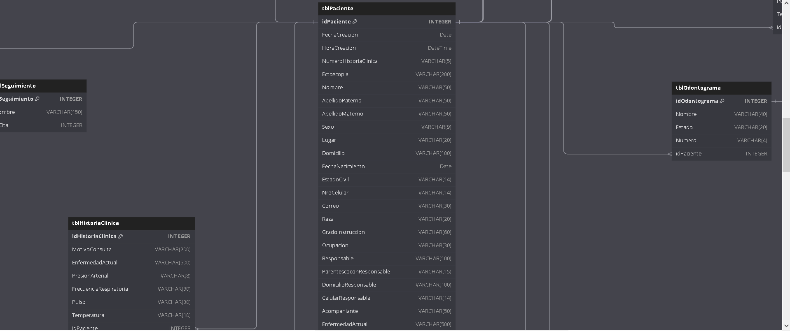
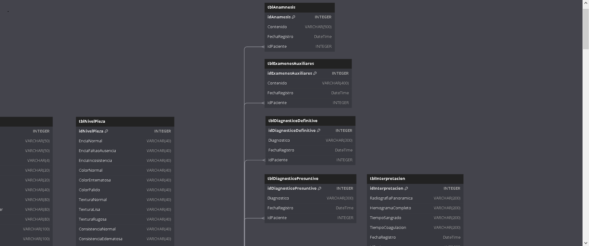
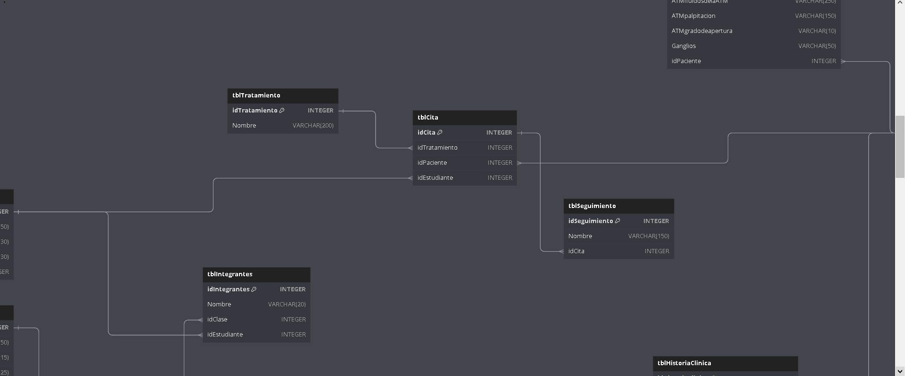

# Clínica Odontológica - Base de Datos (PostgreSQL)

Proyecto académico de base de datos relacional para gestión de una clínica odontológica.

## Contenido
- Scripts de creación (tablas, PK/FK, constraints)
- Scripts de carga de datos (seed)
- Diagrama ER (vista general y recortes)

## Cómo ejecutar (PostgreSQL)
Ejecutar en este orden:
1. `postgres/01_schema.sql`
2. `postgres/02_seed_parte1.sql`
3. `postgres/03_seed_parte2.sql`
4. `postgres/04_seed_parte3.sql`
5. `postgres/05_queries.sql`

## Diagrama ER
Vista general:

Secciones:

Estado: scripts probados en pgAdmin (OK).
